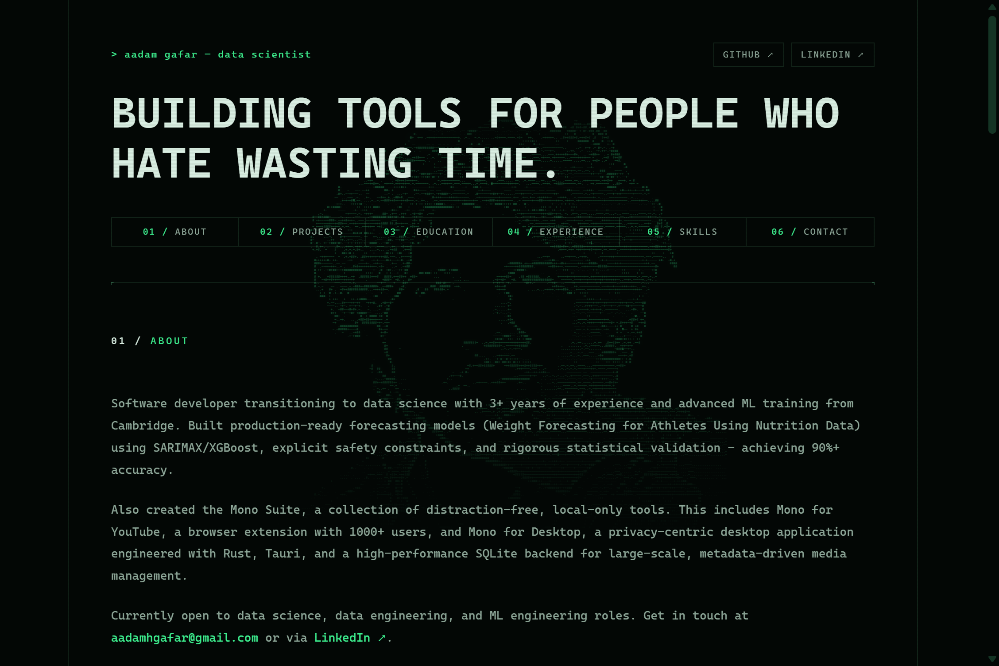

# Aadam Gafar Portfolio

My personal website and online CV to introduce who I am, the work I've done, and how to get in touch. Live at [aadamgafar.com](https://aadamgafar.com).

## What's On It

- **About** - a short intro to who I am and what I do
- **Projects** - featured things I've built, each with a link to find out more
- **Education** - my degrees and courses
- **Experience** - where I've worked and what I did there
- **Contact** - a form that opens your email app with a message ready to send

## Look And Feel

The site has a retro, terminal-style look.

- When the page loads, the heading types itself out as if someone were tapping it in, then the rest of the page appears.
- In the background there's a portrait of me drawn out of text characters. It fades in from the top and quietly flickers as you browse.
- The headline scrambles and then "decodes" into place.

If you prefer less movement, the site respects your device's "reduce motion" setting and skips the animations.

## Featured Projects

The projects shown on the page are listed in one place in the code, so they're easy to add to or update. Each one has a name, a short description, the tools it was built with, and a link or two.
